# PROJETO HIDROELÉTRICO

  - Juliana Barbacena Motta - 14/0147233
  - Tiago Simon Engelsdorff - 14/0032592
  - Gustavo Schafhauser Bocon - 14/0021761
  - Yann Uatanabi Gaspar de Almeida - 14/0166190

### Projeto do Aproveitamento

O projeto do aproveitamento consistirá na realização e apresentação de cálculos oriundos de dados de um dado aproveitamento hidrelétrico visando a instalação de uma usina hidrelétrica. Cada item deverá ser respondido neste documento do repositório, usando a ferramenta de edição.

  - Cada grupo terá em sua pasta do repositório um conjunto de dados de vazão que deverá ser usado ao longo deste e dos demais projetos quando necessário;
  
  - Modelamento do aproveitamento hidrelétrico. Cada grupo deverá mostrar como ficará o sistema hidromecânico equivalente através do cálculo da energia hidráulica média disponível e do trabalho específico. O grupo 2 deverá usar a  altura de cota **de 5 m** para seu aproveitamento hidrelétrico:

       

  - Determinação da queda do aproveitamento: O grupo 2 deverá considerar uma perda de **1 m**, onde cada grupo deverá especificar se a central será de baixa ou de alta queda;
  
    + Como a altura de cota do aproveitamento é baixa, 5 m, deve-se utilizar uma turbina com alta rotação específica, como a Turbina de reação do tipo Kaplan. Com isso, a central hidrelétrica do projeto será classificada como de Baixa Queda.
  
       
  - Determinação da vazão média de longo tempo baseado nos dados de vazão dados a cada grupo. Cada grupo deverá mostrar como fez este cálculo e as hipóteses adotadas;
  
    + Para a obtenção da vazão média de longo tempo, foi feita uma média das vazões medidas diariamente ao longo dos anos de 1931 a 2013, usando o software Excel. O valor obtido foi de 490,67 m³/s.
    
  - Cálculo da potência hidráulica máxima teórica média e da energia máxima teórica média;
  
    Para o cálculo da potência hidráulica máxima teórica média, foi usada a seguinte expressão:
  
    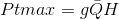
    
    Considerando H como a altura de cota (Hb) menos a perda (Hp), tem-se:
    
    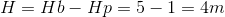
    
    Substituindo os valores de H = 4m, Q = 490,67m³/s e g = 9,81m²/s, temos:

    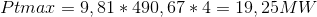
    
    A energia hidráulica máxima teórica média será dada pela expressão:

    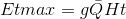
    
    Portanto, ao longo de um dia, a energia teórica máxima média gerada pelo aproveitamento é de:
    
    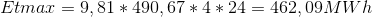
  
  - Análise dos dados de vazão e energia máxima teórica média;
  
     A variação da vazão ao longo do tempo pode ser observada no gráfico a seguir:
  
    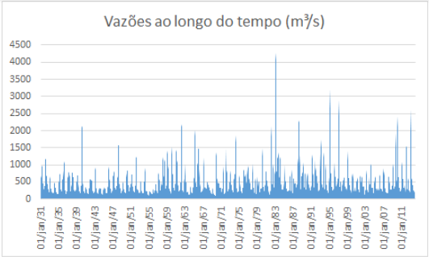
    
    A avaliação estatística dos dados de vazão observados diariamente, entre os anos de 1931 e 2013, está resumida na tabela a seguir:

    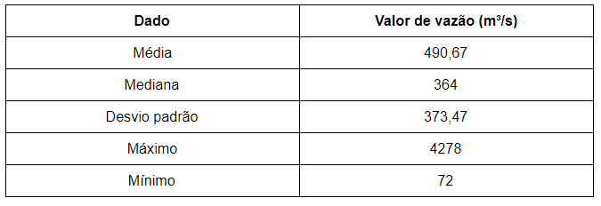
    
    Como podemos notar, os valores de vazão no rio indicado são altamente inconstantes, possuindo variações bruscas como tendência,  característica observável pelo alto desvio padrão encontrado.
	  De semelhante modo, a energia que o aproveitamento seria capaz de gerar, com os valores obtidos, é diretamente proporcional à vazão, e, portanto, também seria relativamente inconstante. Essa característica prejudica o empreendimento, seja economicamente, com a geração de pouca energia em períodos de baixa vazão ou com a impossibilidade do aproveitamento dos períodos de vazão muito alta, dado a limitação estabelecida pela potência nominal, seja tecnicamente, pela maior dificuldade de operação da rede. Tal questão pode ser contornada através do dimensionamento de um reservatório que regularize a vazão turbinada, questão essa a ser explorada no arranjo técnico da usina.

  - Escolha do tipo de central e o arranjo utilizado;
  
    Assumindo que o aproveitamento em questão se trata de uma produção independente autoprodução ou autônoma, e que a área do reservatório delimitada pelo nível d’água máximo normal é igual ou inferior a 13km², e atende à condição:

    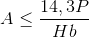
  
    onde P é o perímetro concernente à área delimitada, então esse aproveitamento pode ser classificado como uma Pequena Central Hidrelétrica (PCH), conforme as determinações da Resolução 652 da Agência Nacional de Energia Elétrica (ANEEL).
    
    Visto que a potência instalada leva em consideração os valores de vazão médios obtidos, os valores de vazão diários que estão abaixo da média não serão capazes de entregar a potência nominal da instalação. Por esse motivo, o arranjo adotado deverá ser de uma central de acumulação com regularização. Esse arranjo requer reservatórios maiores, de modo a acumular água do rio para produção no período de menor vazão.

  - Estimativa da potência instalada;
  
    A potência instalada pode ser calculada através da expressão:

    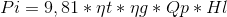
    
     Ao negligenciarmos os rendimentos do gerador e da turbina, visto que não conhecemos suas características, e considerarmos a vazão de projeto, Qp, como sendo a vazão média, temos:
    
    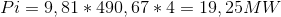
  
     Visto que será utilizada uma turbina Kaplan. temos que o desenho esquemático do sistema hidromecânico equivalente a ser instalado se encontra na imagem abaixo:
  
  - Desenho esquemático do sistema hidromecânico equivalente;
  
    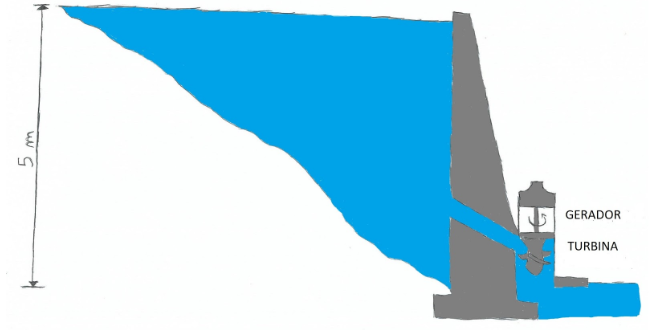
  
  - Cada grupo deverá preencher uma ART (Anotação de Responsabilidade Técnica) para:

    - **Cargo e Função**, designando a tarefa de cada membro do grupo;
    - **Atuação**, designando os projetos a serem executados para a construção da usina;
    - **Obras e Serviços**, designando quais obras e serviços **relacionados a estudos, serviços e projetos civis** deverão ser executados para a construção da usina;

        Um arquivo de ajuda de preenchimento e um modelo de ART estão disponibilizados neste repositório. **Cada grupo deverá fazer suas ARTs baseado no modelo disponibilizado e fazer o *upload* para este repositório, sem recorrer a arquivos prontos na internet**;
        
- Projetos que não tiverem todos estes itens respondidos **não serão avaliados!**
Este projeto deverá ser feito neste arquivo, com o *upload* das respectivas ARTs, será até o dia **02/09/2018**. Pedidos de adiamento só serão concedidos em casos excepcionais, a serem decididos pelo professor.

### Projeto Hidrológico

O projeto hidrológico consistirá na realização e apresentação de cálculos hidrológicos para o projeto de uma central hidrelétrica. Cada item deverá ser respondido neste documento do repositório, usando a ferramenta de edição.

  - Com os dados de vazão usados no projeto do aproveitamento, os grupos deverão identificar e organizar os dados em médias semanais (Se a disposição dos dados for diária) ou anuais (Se a disposição dos dados for mensal);
  
  - Cada grupo deverá realizar uma caracterização estatística destes dados. Para a caracterização dos dados, o grupo deverá utilizar de programação, onde a linguagem de programação é de livre escolha do grupo. **O algoritmo programado deverá ser enviado ao repositório via *upload*. Não será permitida a utilização de planilhas excel ou de programas já feitos**. Os seguintes itens deverão ser respondidos neste documento:
  
       - Fluviograma dos dados, dispostos em valores anuais e decenais;
       
       - Curva de duração de vazões;
       
       - Curva de duração de potência para uma queda (Determinada no projeto do aproveitamento) e rendimento de **85%**;
       
       - Diagrama de Rippl;      

       - Determinação do período crítico;
        
       - Determinação de períodos seco e úmido;
        
       - Determinação de valores extremos;
        
       - Estimativa da vazão firme e da vazão de projeto para dimensionamento de uma central hidrelétrica;
        
      
       - Cálculo da vazão regularizada: O grupo deverá fazer um cálculo da vazão regularizada baseado nos dados fornecidos de vazão. O método a ser usado é o método de Conti-Varlet. A formulação deste método está disponível no livro-texto do curso (Souza, Z., Santos, A. H. M e Bortoni, E. C.  **Centrais Hidrelétricas: Implantação e Comissionamento**, 2a. Edição, Editora Interciência.). Para este cálculo o grupo deverá:
        
       - Usar o programa disponibilizado pelo livro-texto do curso ou implementar o método em uma linguagem de programação da escolha do grupo. Caso o grupo escolha a segunda alternativa, **o algoritmo programado deverá ser enviado ao repositório via *upload***;
       
       - Análisar o resultado obtido de vazão regularizada e comparar este resultado com as vazões firme e de projeto calculados anteriormente;
        
  - Projetos que não tiverem todos estes itens respondidos ou que estiverem incompletos **não serão avaliados!**
Este projeto deverá ser feito neste arquivo até o dia **23/09/2018**. Pedidos de adiamento só serão concedidos em casos excepcionais, a serem decididos pelo professor.

### Projeto do Conduto

O projeto do conduto consistirá na realização e apresentação de cálculos de condutos e canais para a central hidrelétrica. 

  - Projeto do canal para a futura usina hidrelétrica utilizando as fórmulas de Chezy, determinando de acordo com os dados de vazão de cada grupo:
     
       -A melhor forma geométrica de seção para o canal em questão;
       
       - O diâmetro hidráulico da seção;
       
       - Velocidade da água no canal;
       
       - Vazão de água no canal;
       
      
  - Baseado nos valores de queda dispostos no projeto do aproveitamento, o grupo deverá inserir no desenho esquemático deste projeto os seguintes itens:
        
       - Valores de cota de altura;
       - Alturas de queda;
       - Linhas piezométrica e de energia;
        
  - Determinação do semiperíodo da onda de pressão para dimensionamento do conduto fechado. Cada grupo poderá fazer as considerações que achar necessárias;
  
  - Determinação de valores de golpe de aríete positivo máximo;
  
  - Determinação de valores do golpe de aríete aceitável;
  
  - Projetos que não tiverem todos estes itens respondidos ou que estiverem incompletos **não serão avaliados!**
Este projeto deverá ser feito neste arquivo até o dia **07/10/2018**. Pedidos de adiamento só serão concedidos em casos excepcionais, a serem decididos pelo professor.

### Projeto da Turbina

O dimensionamento preliminar de uma turbina consistirá em determinar e dimensionar uma turbina para uma dado aproveitamento hidrelétrico. 

  - Cada grupo deverá especificar qual devem ser a potência e vazão da turbina a ser projetada, baseados nos cálculos dos projetos anteriores;
  
  - Estime a rotação nominal da turbina, considerando um gerador com 10 pólos e frequência de corrente de 60 Hz;
  
  - Para um modelo reduzido de 0,075 m de diâmetro, estime qual deve ser a razão de escala geométrica necessária para se obter os valores de potência e vazão determinados no primeiro item;
  
  - Mostre o triângulo de velocidades para estas condições para turbinas Kaplan, Francis e Pelton. Faça as considerações que achar necessárias e explique-as;
  
  - Determine a rotação específica e classifique a turbina como lenta, rápida ou extra-rápida;
  
  - Estime a velocidade de disparo da turbina;
  
  - Estime o fator de capacidade;
  
  - Qual é o tipo de turbina mais adequado para este aproveitamento?
  
  - Se for o caso, determine a altura de sucção e diga se existe risco de cavitação;
  
  - Com os cálculos, a usina que conterá esta turbina será classificada como? (Pequena central hidrelétrica, Grande central hidrelétrica, etc.)
  
  - Projetos que não tiverem todos estes itens respondidos ou que estiverem incompletos **não serão avaliados!**

Os dados faltantes poderão ser estimados pelo grupo, desde que a forma de estimativa seja devidamente explicada. É facultada a utilização de ferramentas computacionais. Este projeto deverá ser feito neste arquivo até o dia **25/11/2018**. Pedidos de adiamento só serão concedidos em casos excepcionais, a serem decididos pelo professor.
